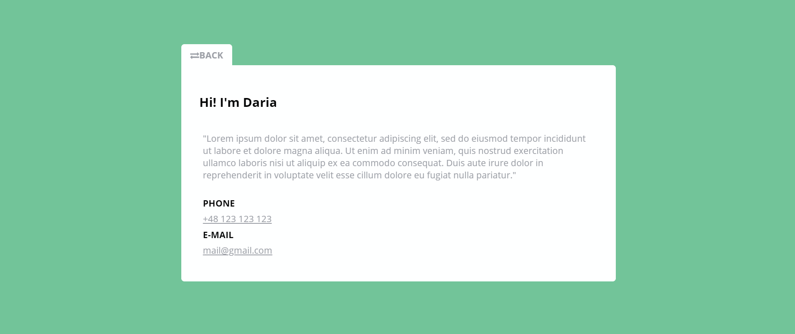
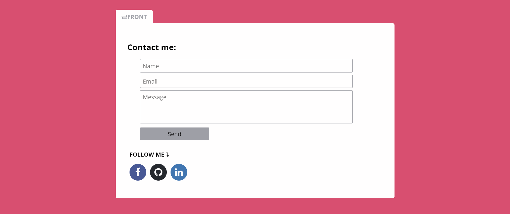

# BUSINESS CARD (HTML & CSS)

When designing the business card I wanted to reflect its real **form** and add **innovation**. For this reason, it consists of a front and back side, the transition between them is made possible by an animation of a "rotating" business card.
The business card is available on GitHub Pages: https://t-daria.github.io/CodersCamp2020.Project.HTML-CSS.BusinessCard/

### Files: 

- **index.html** contains HTML structure of the web page of front side of business card,

- **back.html** contains HTML structure of the web page of back side of business card,

- **style.css** contains CSS styling of the web page (with comments)

### Included functionalities that CSS provides:

- Box-model 
- Cascading CSS 
- CSS selectors 
- Popular HTML tags 
- How to connect CSS to HTML 
- Saving colours 
- Text styling 
- External icons/phones (fontawesome, google fonts) 
- Flexbox 
- Keyframes animations 
- Form 
- Responsive Web Design